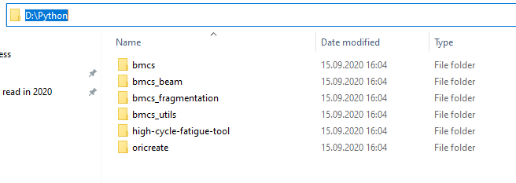
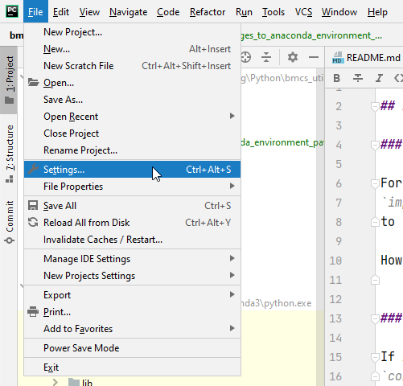
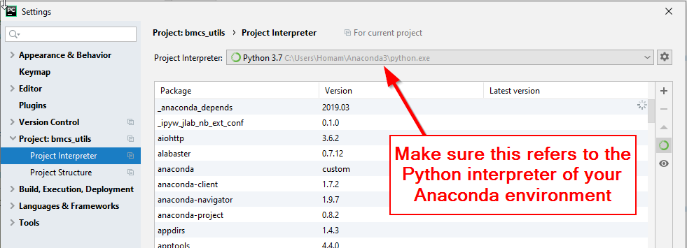

# Setup the BMCS development environment

## Miniconda / Anaconda

The packages used in the development of the BMCS tool suite can be conveniently 
accessed from within the miniconda minimal setup. The installation for 
all platforms is provided here:

https://docs.conda.io/en/latest/miniconda.html

## Git

Install the git package. 
For linux use:

sudo apt-get install git

For windows usd:

## PyCharm

register and pickup the professional academic free version
https://www.jetbrains.com/pycharm/download

Follow the instructions there to install it.

## Clone bmcs repositories 

Start pycharm. In the introductory window select 
- open from version control system. Register using the github.com
credentials. Clone the repository

bmcs-group/bmcs_utils

## Setup your environment 

In the root directory of this package, there is the environment.yml 
file specifying all packages required for the execution and development
of bmcs packages. Issue the command:

conda env create -f=environment.yml

which will install the scientific computing environment called bmcs.
You can activate the individual conda environments using the commands

conda env list
conda activate bmcs

In all your bmcs pycharm projects define the Python interpreter from choose the 
the bmcs conda environment. This will set up all the other dependencies 
correspondingly.

## Setup the import path for bmcs packages
 
Since the bmcs packages can refer to each other within your 
pycharm project directory add the path to this directory to your 
bmcs conda environment.

### Why?

For using common Python packages like numpy, it's enough to install the package and then you can use
`import numpy as np`
to use it in any Python module.

However, to use custom Python packages in a Python module that is located outside the package directory, you need to add the path of this package to your Python environment.
 

### How?

If Anaconda is used as the Python environment perform the following command in the Anaconda Prompt:\
`conda-develop /path/to/my_python_packages`

_How it works?_\
This command will simply add the file `"USER_HOME_DIRECTORY\Anaconda3\Lib\site-packages\conda.pth"` which contains the paths.

### Example

* We have the following custom Python packages:

* The following command is excuted
`conda-develop D:\Python`

* Now it's possible to import any module from these custom packages in any external Python module such as `from bmcs_utils.api import IPWInteract`

**Note for PyCharm:**\
Now as long as you're using the Python interpreter that comes with Anaconda environment 
within your PyCharm project, you should be able to import your packages.

